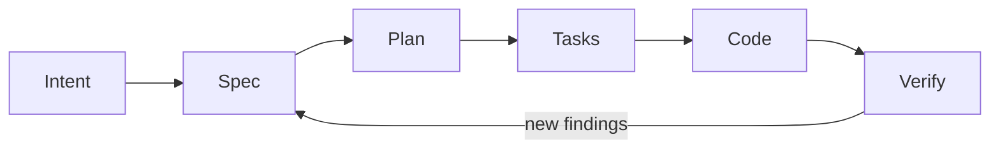
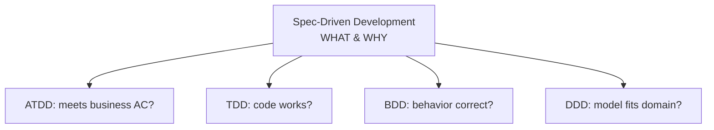
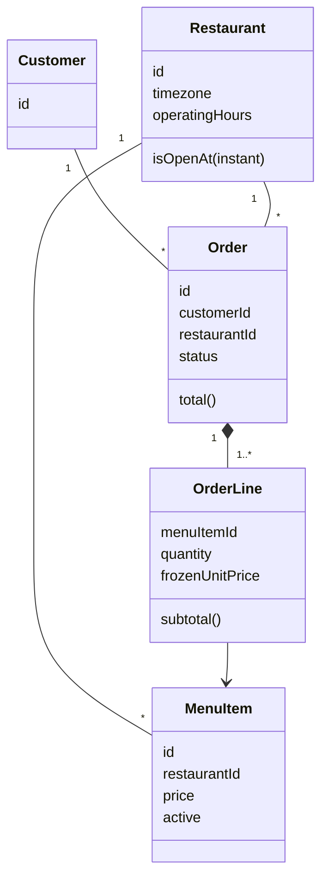
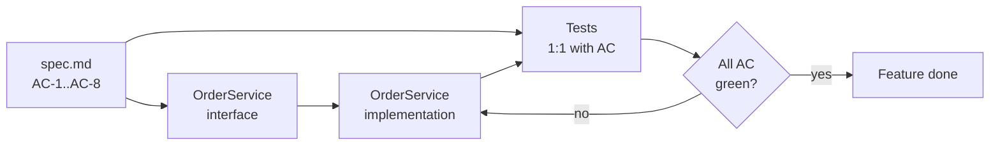

# Diagramas reutilizables (Mermaid)

> Embebibles en Marp si tu render lo soporta, o copiar/exportar manualmente.

---

## SDD Cycle

---

## SDD vs other methodologies

---

## Order Domain

---

## Spec → Code → Verify (with AC mapping)

---

## Cómo renderizar

- **VS Code**: extensión "Markdown Preview Mermaid Support".
- **Marp**: requiere plugin `marp-plugin-mermaid` o exportar a PNG.
- **CLI**: `npx -y @mermaid-js/mermaid-cli -i diagrams.md -o out.svg`.
